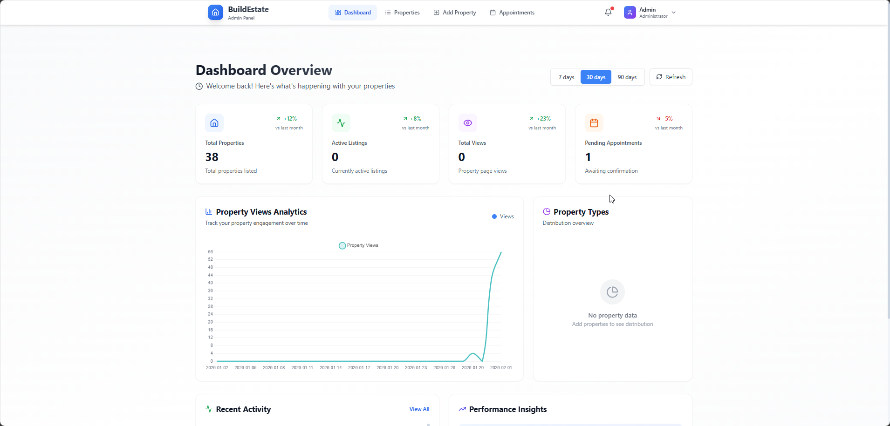

# Project Report — Advanced Databases (NoSQL) — Real Estate Website

## Executive Summary

This repository contains a full-stack Real Estate web application built to satisfy the Advanced Databases (NoSQL) final project requirements. The system uses MongoDB as the primary datastore, exposes a RESTful API, implements meaningful business logic, and provides a React frontend for user interaction. This report explains the implementation step-by-step, maps each course requirement to code evidence, and includes run and defense instructions.

## Table of Contents
- 1. Project goals and compliance
- 2. Architectural overview
- 3. Step-by-step implementation (backend, models, controllers, routes)
- 4. Aggregations and analytics (detailed)
- 5. Advanced updates and transactions
- 6. Indexes and query optimization
- 7. Authentication & authorization
- 8. Frontend: pages & API integration
- 9. Tests and verification
- 10. How to run and demonstrate the project
- 11. Grading mapping (rubric evidence)

## 1. Project goals and compliance

Goal: implement a web application (backend + frontend) where MongoDB is the main storage and the backend exposes a REST API with advanced NoSQL features.

Compliance summary:
- REST API endpoints: 40+ endpoints implemented (see `backend/routes/`).
- Frontend pages: 5 user-facing pages (Home, Properties, About, Contact, AI agent) in `frontend/src/pages` — satisfies single-student requirement of 4 pages.
- Multi-stage aggregation pipelines, compound and text indexes, embedded and referenced models, advanced update operators, JWT auth, and role-based authorization are implemented.

## 2. Architectural overview

- Backend: Node.js + Express, modular structure:
	- Models: `backend/models/*`
	- Controllers: `backend/controller/*`
	- Routes: `backend/routes/*`
	- Middleware: `backend/middleware/*` (auth, multer, stats)
- Frontend: React (Vite) at `frontend/` (SPA), with an Admin app under `admin/`.
- Database: MongoDB (local or Atlas). Collections: `users`, `properties`, `appointments`, `paymentcontracts`, `stats`, `news`, `forms`.

Diagram (conceptual): frontend ↔ backend (REST) ↔ MongoDB

## 3. Step-by-step implementation

Step 1 — Project scaffolding
- Created `backend/`, `frontend/`, and `admin/` directories. Backend uses ES modules and dotenv for configuration. See `backend/package.json` and `backend/.env.local.example`.

Step 2 — Models (schema design)
- `Property` (`backend/models/propertymodel.js`): referenced `owner` (ObjectId → `User`), embedded `reviews` array (subdocuments storing rating, comment, `userId` reference). Fields: `title`, `location`, `city`, `price`, `image[]`, `beds`, `baths`, `sqft`, `type`, `availability`, `amenities`, `tags`, `rating`, `viewCount`, `appointmentCount`.
- `User` (`backend/models/Usermodel.js`): user identity, `properties` (ObjectId[]), `appointments` (ObjectId[]), `role` for authorization.
- `Appointment` (`backend/models/appointmentModel.js`): references (`propertyId`, `userId`), `status` enum, `meetingLink`, `feedback` embedded object.
- `PaymentContract`, `Stats`, `Form`, `News`: additional collections.

Design rationale:
- Use references for large entities (owner → `User`) to avoid duplication and allow population.
- Use embedded subdocuments for small, tightly-coupled data like `reviews` where reads often include reviews with the property.

Step 3 — Routes & Controllers
- Routes organized by resource: `backend/routes/ProductRouter.js`, `advancedPropertyRoutes.js`, `UserRoute.js`, `appointmentRoute.js`, `paymentContractRoute.js`, `newsRoute.js`, `formrouter.js`.
- Controllers implement business logic in `backend/controller/*`. Examples:
	- `productcontroller.js`: uploading images (ImageKit), create/read/update/delete property documents.
	- `advancedPropertyRoutes.js`: search, analytics, advanced updates (`$push`, `$pull`, `$inc`, `updateMany`).
	- `appointmentController.js`: appointment scheduling with conflict checks, email notifications via Nodemailer.

Step 4 — Middleware
- `authmiddleware.js`: `protect` verifies JWT and attaches `req.user`. `authorize(...roles)` enforces role-based access.
- `multer.js`: file upload handling for property images.

## 4. Aggregations and analytics (detailed)

Implemented multi-stage aggregation pipelines for real business use-cases:
- Price analytics by location (`/api/analytics/price-by-location`): $match -> $group -> $project -> $sort. Produces average, min, max prices, pricePerSqft, etc.
- Top-performing properties (`/api/analytics/top-performing`): $addFields (performanceScore computed), $lookup (join to `users`), $project, $sort, $limit.
- Market trends (`/api/analytics/market-trends`): monthly grouping by `createdAt` with averages and counts.
- Appointment and views stats (`appointmentController.js`, `adminController.js`) using `$match`, `$group` by date and `$sort`.

Why it matters: these pipelines show ability to perform data aggregation in multiple stages and combine data across collections via `$lookup`.

## 5. Advanced updates and deletes

Examples:
- Add/Remove amenity: `PUT /properties/:id/add-amenity` uses `{ $push: { amenities: amenity } }` and `remove` uses `$pull`.
- Increment views: `PUT /properties/:id/increment-views` uses `$inc` and `$set` to update timestamps atomically.
- Add review: `PUT /properties/:id/add-review` pushes a review subdocument and increments counters with `$inc`.
- Bulk status update: `PUT /properties/bulk-update-status` uses `updateMany` with `$set` and is protected by `authorize('admin')`.

These demonstrate advanced update operators and bulk operations required by the rubric.

## 6. Indexes and query optimization

Indexes implemented in model definitions:
- `propertySchema.index({ city: 1, price: 1 })`, `{ type: 1, availability: 1 }`, `{ owner:1, createdAt:-1 }` (compound)
- Text index: `{ title: 'text', description: 'text', location: 'text' }` for full-text search used by `/properties/search`.
- `User` and `Appointment` models contain indexes optimized for common queries (email, createdAt, userId/date lookups).

Justification: indexes chosen to support primary query patterns (search by city/type/price ranges, sort by createdAt, text search). Compound indexes reduce query cost for combined predicates.

## 7. Authentication & authorization

- JWT tokens created at login/registration (`Usercontroller.js`), stored on client and sent in `Authorization: Bearer <token>` header.
- `protect` middleware validates token and loads user. `authorize('admin')` checks role for admin endpoints.
- Passwords hashed with `bcrypt`. Password reset implemented using secure random token and expiration.

Security notes: ensure production uses strong `JWT_SECRET`, HTTPS, and secure cookie or localStorage handling on frontend.

## 8. Frontend: pages & API integration

- Pages: `Home.jsx`, `Properties.jsx`, `About.jsx`, `Contact.jsx`, `Aiagent.jsx` under `frontend/src/pages`.
- The frontend performs real HTTP requests to backend endpoints (search, property details, schedule appointment, auth flows). It handles token storage and attaches tokens to API calls.

## 9. Tests and verification

- Test file: `backend/tests/status.test.js` (Jest + supertest) — run with `npm test` in `backend/`.
- Manual verification: start backend, run API calls (Postman/cURL), and exercise frontend flows.

## 10. How to run and demonstrate the project (step-by-step)

Prerequisites: Node.js, npm, MongoDB (local or Atlas), and environment variables (copy `.env.local.example` to `backend/.env.local`).

Commands:
```powershell
# Backend
cd backend
npm install
npm test        # run automated test(s)
npm run dev     # starts backend on configured port (default 4000)

# Frontend
cd ../frontend
npm install
npm run dev     # starts frontend (default 5173)

# Admin (optional)
cd ../admin
npm install
npm run dev     # admin UI (default 5174)

```

Demonstration checklist:
1. Show `mongo`/MongoDB Compass collections and indexes.
2. Execute `GET /api/analytics/top-performing` and explain aggregation stages.
3. Search properties via frontend and show text search results.
4. Create/Update/Delete a property via API or frontend.
5. Schedule an appointment (protected route) to demonstrate `protect` middleware and email notification.

## 11. Grading mapping (rubric evidence)

- A. MongoDB Implementation (50 pts)
	- CRUD operations across `Property`, `User`, `Appointment`, `PaymentContract`, `Form`, `News` — implemented in controllers.
	- Data modeling: embedded `reviews` vs referenced `owner` — `backend/models/propertymodel.js`.
	- Advanced update/delete: `$push`, `$pull`, `$inc`, `$set`, `updateMany` — `advancedPropertyRoutes.js`.
	- Aggregation framework: multi-stage pipelines in `advancedPropertyRoutes.js` and `appointmentController.js`.
	- Indexes & optimization: compound and text indexes in model files.

- B. Backend & REST API (30 pts)
	- REST API design: resource-based routes split in `backend/routes`.
	- Business logic: appointment conflict checks, performance scoring in analytics, payment contract safeguards.
	- Security: JWT auth, `protect` and `authorize` middleware, password hashing.
	- Code quality: modular controllers, error handling, middleware separation.

- C. Frontend (10 pts)
	- Functional pages: 5 implemented.
	- API integration: front-end requests to backend endpoints.
	- Usability: responsive templates and error handling.

- D. Documentation (10 pts)
	- Schema and API docs are included in repository (see `API_DOCUMENTATION.md`, `DATABASE_DOCUMENTATION.md`, `DEFENSE_GUIDE.md`).

## Appendix: Useful file locations
- Backend routes: `backend/routes/`
- Backend controllers: `backend/controller/`
- Backend models: `backend/models/`
- Middleware: `backend/middleware/`
- Frontend pages: `frontend/src/pages/`
- Docs: root-level `API_DOCUMENTATION.md`, `DATABASE_DOCUMENTATION.md`, `PROJECT_COMPLETION_GUIDE.md`, `DEFENSE_GUIDE.md`, `FINAL_SUMMARY.md`.

---
Generated: February 2, 2026

