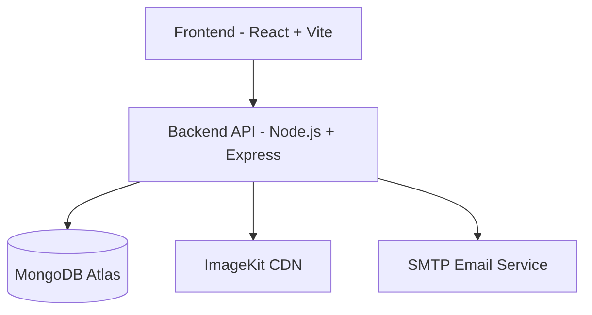

<div align="center">

<!-- Hero Banner -->


# 🏠 DomHouse

<h3 align="center">
  
</h3>

<!-- Tech Badges -->

<p align="center">
  
  
  
</p>

<p align="center">
  
  
</p>

<!-- Action Buttons -->

<p align="center">
  <a href="https://domhouse.vercel.app">
    
  </a>
  <a href="./API_DOCUMENTATION.md">
    
  </a>
  <a href="./DATABASE_DOCUMENTATION.md">
    
  </a>
</p>

</div>

---

## 🌟 Overview

**DomHouse** is a full-stack real estate web application developed as a final project for the course **Advanced Databases (NoSQL)**. The system demonstrates advanced MongoDB data modeling, aggregation pipelines, RESTful API design, authentication, and a modern React-based frontend.

---

## 🎯 Key Features

### 🔍 Property Management

* Property listing with full CRUD operations
* Advanced filtering and search
* Image upload and media handling

### 🤖 AI-Assisted Features

* Automated property description generation
* Price and market insight suggestions

### 🔐 Authentication & Security

* JWT-based authentication
* Role-based access control (User / Admin)
* Protected API routes

### 📱 Frontend Experience

* Responsive design (desktop & mobile)
* Modern UI with TailwindCSS
* Multi-page navigation (Home, Properties, Details, Auth)

---

## 🏗️ System Architecture



---

## 🧰 Technology Stack

| Layer      | Technologies                                |
| ---------- | ------------------------------------------- |
| Frontend   | React 18, Vite, TailwindCSS                 |
| Backend    | Node.js, Express.js                         |
| Database   | MongoDB, Mongoose                           |
| Auth       | JWT, Bcrypt                                 |
| Media      | ImageKit                                    |
| Email      | Nodemailer (SMTP)                           |
| Deployment | Vercel (Frontend), Render/Railway (Backend) |

---

## 🚀 Getting Started

### Prerequisites

* Node.js 16+
* MongoDB Atlas account
* Git

### Installation

```bash
# Clone repository
git clone https://github.com/Nurbek-dev001/Dom-House.git
cd Dom-House

# Backend
cd backend
npm install
cp .env.example .env
npm run dev

# Frontend
cd ../frontend
npm install
npm run dev
```

---

## 🔧 Environment Variables (Backend Example)

```env
MONGO_URI=mongodb+srv://<user>:<password>@cluster.mongodb.net/domhouse
JWT_SECRET=your_secret_key
SMTP_USER=your_smtp_user
SMTP_PASS=your_smtp_password
IMAGEKIT_PUBLIC_KEY=your_key
IMAGEKIT_PRIVATE_KEY=your_key
IMAGEKIT_URL_ENDPOINT=https://ik.imagekit.io/your_id
```

---

## 📡 API Overview

* Full CRUD for properties, users, and appointments
* Aggregation pipelines for analytics and filtering
* Advanced update operators: `$set`, `$push`, `$pull`, `$inc`
* Protected routes with middleware

Detailed endpoints are described in **API_DOCUMENTATION.md**.

---

## 📚 Documentation

* **API_DOCUMENTATION.md** – REST API endpoints and examples
* **DATABASE_DOCUMENTATION.md** – MongoDB schema and relations
* **PROJECT_COMPLETION_GUIDE.md** – Course requirements mapping

---

## 🎓 Course Information

* **Course:** Advanced Databases (NoSQL)
* **Project Type:** Full-stack Web Application
* **Database:** MongoDB
* **Assessment:** Final Project with Defense

---

## 🙏 Acknowledgment

This project was developed for academic purposes to demonstrate practical skills in NoSQL databases, backend development, and modern frontend engineering.

---

<p align="center">
  Built for the Advanced Databases (NoSQL) course •
</p>

